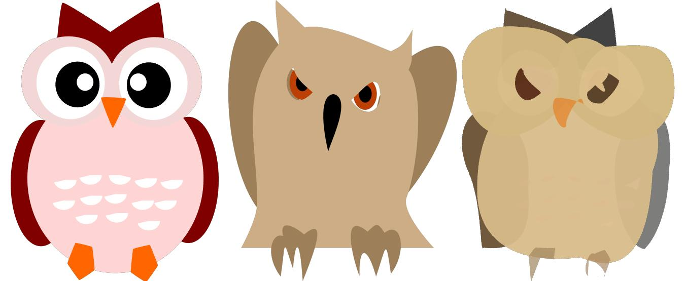
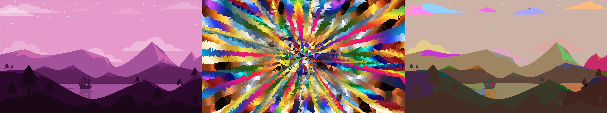
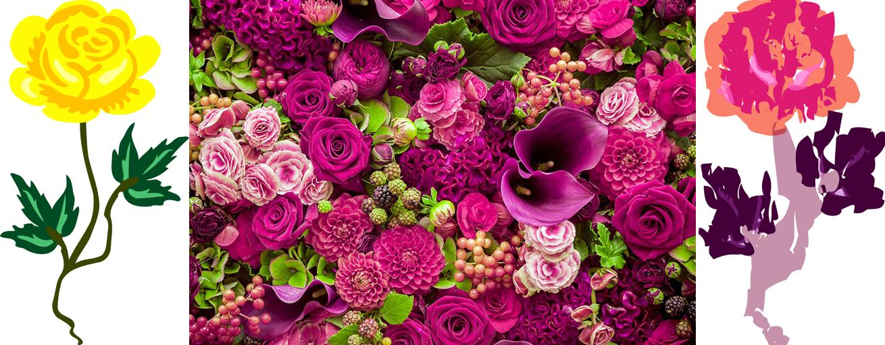

# Библиотека методов машинного обучения по обработке и генерации векторной графики

В данной библиотеке представлены методы генеративной обработки векторной графики.

Библиотека содержит следующие методы:

## EvoVec - эволюционный метод оптимальной векторизации изображений

[Более подробная документация](./EvoVec-Evolutionary-Image-Vectorization/Readme.md)

## Проверка плагиатов чертежей на основе рекурсивного трансформера с памятью

[Более подробная документация](./extended_recursive_memory_transformer/Readme.md)

## VectorNST - современный итеративный метод переноса стиля в векторной графике

  
  
  

Перенос нейронного стиля привлекает внимание многих научных исследователей, дизайнеров и художников, но ранее интерес
был сосредоточен только лишь на растровых изображениях. Существуют различные модели для генерации растровых изображений
с предварительно обученными стилями и даже для произвольных стилей. Однако перенос стиля между векторными изображениями
практически не рассматривался. Наше исследование показывает, что применение стандартных функций потерь стиля и контента
незначительно меняют стиль рисования векторных изображений, поскольку структура векторных примитивов сильно отличается
от пикселей. Чтобы справиться с этой проблемой, мы вводим новые функции потерь. Предлагаемое нами решение, VectorNST,
основанное на дифференцируемой растеризации, использует эти новые функции потерь и может изменять параметры цвета и
формы изображения содержимого так, чтобы соответствовать изображению стиля. Качественные эксперименты демонстрируют
эффективность предложенного метода VectorNST по сравнению с современными подходами переноса стиля для растровых
изображений и единственным существующим подходом для стилизации векторных изображений DiffVG.

[Более подробная документация](./VectorNST/README.md)

## CoverGAN - генератор векторных музыкальных обложек на основе пользовательского трека и его эмоции

  
  
  

В работе предлагается создание онлайн-сервиса для генерации векторных обложек музыкальных композиций. Существующие
решения по созданию растровых обложек имеют недостатки, связанные с плохим качеством, отчасти поэтому векторная графика
становится предпочтительным форматом изображений. Мы предлагаем модель, основанную на условной
генеративно-состязательной сети, которая обучается на датасете растровых обложек и создает векторные обложки, учитывая
музыкальные признаки и эмоции. Также
реализована возможность добавления надписи с
информацией об исполнителе и названии трека на обложку.

[Более подробная документация](./CoverGAN/README.md)

## VectorWeaver - безусловный генератор векторных изображений на основе двухэтапного трансформера

Диффузионные модели генерируют реалистичные результаты для растровых изображений, однако генерация векторных изображений
не так успешна из-за существенных различий в структуре изображений. В отличие от растровых изображений, векторные
изображения состоят из фигур, которые описываются своими координатами, цветом и шириной обводки. Количество необходимых
для генерации фигур заранее неизвестно.
Мы решаем проблему синтеза векторных изображений, разрабатывая новую архитектуру модели на основе диффузии и
трансформеров, которую мы назвали VectorWeaver. Для обучения модели мы собрали набор данных векторных изображений из
общедоступных ресурсов, однако его размер был недостаточным. Чтобы обогатить и увеличить его, мы предложили новые
операции аугментации, специфичные для векторных изображений.
Для обучения модели мы разработали специальную функцию потерь, которая позволяет генерировать объекты с плавными
контурами без артефактов.
Качественные эксперименты демонстрируют превосходство и вычислительную эффективность предложенной модели по сравнению с
существующими методами генерации векторных изображений.

[Более подробная документация](./VectorWeaver/README.md)
