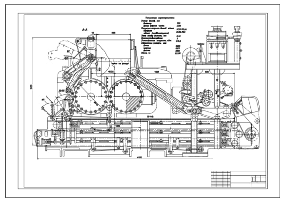
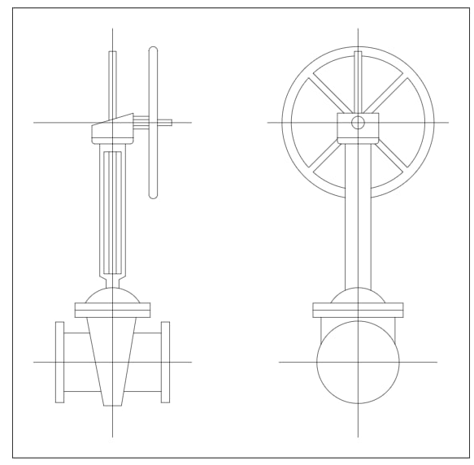

# Extended memory tranformer for vector image analysis

Primary contact: tik11994@mail.ru

## Model objectives

This model is designed to analyze unlimitedly large vector images. Using it you can get vector representation of any vector image without limitation on their size.

## Example of work for a plagiarism search task

| Original image       |     |     | 
|------------------|-------------------------------------------------------------|------------------------------------------------------------|------------------------------------------------------------|--------------------------------------------------------------|-------------------------------------------------------------|
| Plagiarism image |  |  | 

We present a new method for analyzing vector images that can process even large images such as drawings. The demonstrated examples show the ability of the model to search for similar images. 

## Usage

1. ``git clone https://github.com/EgorBa/EvoVec-Evolutionary-Image-Vectorization``
2. ``pip install requirements.txt``
3. [Download] (https://drive.google.com/file/d/1OTfNueVaXMzzgjd7mvheWYWUXHYUcMTM/view?usp=drive_link) the model weights and place it in the folder model
4. Place the data in the data folder
5. If you need to change the reading and writing paths of the results, you can do it in the file config.ini
6. ``python main.py``
